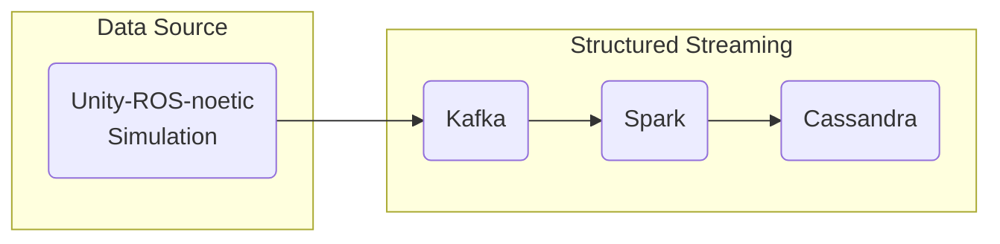

# quixotic-kafka
Python Stream Processing for Apache Kafka.

# Why do I need this?

Currently, I have a Unity-ROS simulation setup in a docker container. I am wanting to learn how to publish ROS topic data into a structured streaming pipeline by building an architecture that includes a data source (my Unity-ROS simulation) and  to collect data without any loss, analyze them and store results in a database.

I am thinking something along the lines of the following diagram. I shall utilize ROS (Robot Operating System) as a data provider, Kafka as a message queue, Apache Spark as a data processing engine and Apache Cassandra as a database.



Also, it would be fun to setup a structured streaming pipeline without having to deal with unnecessary headers involved with ROS simulation.

# Setup

Firstly, I have my ROS simulation up and running in a docker. I would want to publish the rostopic data into Kafka (producer). Then I would setup a way to fetch the data from Kafka (consumer).

Setup kafka console on the host machine using the [Quix CLI](https://quix.io/docs/quix-cli/cli-quickstart.html)

```sh
curl -fsSL https://github.com/quixio/quix-cli/raw/main/install.sh | bash
```

To verify you have the dependencies installed, run the following command:

```sh
quix status
```
View the output carefully to confirm you have Git and Docker installed:
```
✗ Not logged in
  User:                       ! Not logged in to Quix Cloud
  Current context:            default (https://portal-api.platform.quix.io)
  Default environment:        ! Not set
  SDK Broker configuration:   Local (localhost:19092)
! Local Pipeline Status:      Not Running
✓ Local Broker Status:        Running (localhost:19092)
✓ Local Broker GUI:           Running (http://localhost:8080)
✓ Docker detected
✓ Git detected
  Git Root:                   /home/vishal/mygithub/quixotic-kafka
```

The following command will create the right docker compose file such that you have a broker running on localhost:19092 and you do not have to worry about setting up the environment variables and the configuration.
```sh
quix pipeline up
```


## Connectivity issues

1. Firstly, I need my ROS docker container to be able to communicate with kafka. For this, I need to setup the `HOST_IP` environment variable and start up the docker compose.

```sh
vishal@vishal:~/mygithub/quixotic-kafka$ hostname -I
10.0.0.82 172.19.0.1 172.17.0.1 172.18.0.1 2601:14b:4501:7440::edf4 2601:14b:4501:7440:81b8:80f:ecf5:86a2 2601:14b:4501:7440:a97a:5401:b552:cbec
```

I will setup a bash script to setup the `HOST_IP` environment variable and start up the docker compose.

```sh
#!/bin/bash

# Get the host IP address
export HOST_IP=$(hostname -I | awk '{print $1}')

# Run Docker Compose
docker compose down && docker compose up -d
```

I shall execute the above bash script that uses the docker compose file below to start the kafka and zookeeper containers.

```yml
services:
  zoo1:
    image: confluentinc/cp-zookeeper:7.3.2
    hostname: zoo1
    container_name: zoo1
    ports:
      - "2181:2181"
    environment:
      ZOOKEEPER_CLIENT_PORT: 2181
      ZOOKEEPER_SERVER_ID: 1
      ZOOKEEPER_SERVERS: zoo1:2888:3888
    networks:
      - my_ros_network

  kafka1:
    image: confluentinc/cp-kafka:7.3.2
    hostname: kafka1
    container_name: kafka1
    ports:
      - "9092:9092"
      - "29092:29092"
    environment:
      KAFKA_ADVERTISED_LISTENERS: INTERNAL://kafka1:29092,EXTERNAL://${HOST_IP}:9092
      KAFKA_LISTENERS: INTERNAL://0.0.0.0:29092,EXTERNAL://0.0.0.0:9092
      KAFKA_LISTENER_SECURITY_PROTOCOL_MAP: INTERNAL:PLAINTEXT,EXTERNAL:PLAINTEXT
      KAFKA_INTER_BROKER_LISTENER_NAME: INTERNAL
      KAFKA_ZOOKEEPER_CONNECT: "zoo1:2181"
      KAFKA_BROKER_ID: 1
    depends_on:
      - zoo1
    networks:
      - my_ros_network

networks:
  my_ros_network:
    external: true
```

My kafka and zookeeper are on `my_ros_network`. However, my ROS docker container is using `host` network.

2. Next, my ROS docker container needs to connect to the kafka and zookeeper containers.


```sh
vishal@vishal:~$ catkin-docker run
55c0ca9f980ef2553d78664ef64659545619c36894a32c3a8b91609c1df4d9bf
vishal@vishal:~$ docker exec -it 55c0ca9f980ef2553d78664ef64659545619c36894a32c3a8b91609c1df4d9bf /bin/bash
root@vishal:/home/vishal# source docker-build/install/setup.bash
root@vishal:/home/vishal/kafka-producer# cat setup.sh
apt update && apt install python3.8-venv  telnet -y
pip3 install -r requirements.txt
root@vishal:/home/vishal/kafka-producer# ./setup.sh
root@vishal:/home/vishal/kafka-producer# telnet 10.0.0.82 9092
Trying 10.0.0.82...
Connected to 10.0.0.82.
Escape character is '^]'.


Connection closed by foreign host.
```

I am able to connect to the kafka container. Now, I need to push data into kafka.

2. I need to make sure that my ROS simulation is publishing the data into the topic. Since I have not started a simulation, I won't be able to get any data out.

```sh
root@vishal:/home/vishal# rostopic list
ERROR: Unable to communicate with master!
root@vishal:/home/vishal/kafka-producer# python3 kafka_producer.py
Hostname: vishal
IP Address: 10.0.0.82
Unable to register with master node [http://localhost:11311]: master may not be running yet. Will keep trying.
```

```python
import rospy
from nav_msgs.msg import Odometry
import json
from datetime import datetime
from kafka import KafkaProducer
import socket
import subprocess

def get_hostname()->str:
    # Get the hostname
    hostname = socket.gethostname()

    # Get the IP address
    try:
        # Run the 'hostname -I' command and capture its output
        result = subprocess.run(['hostname', '-I'], capture_output=True, text=True, check=True)
        # Split the output and take the first IP address
        ip_address = result.stdout.split()[0]
    except subprocess.CalledProcessError:
        # If 'hostname -I' fails, fall back to socket method
        ip_address = socket.gethostbyname(hostname)

    print(f"Hostname: {hostname}")
    print(f"IP Address: {ip_address}")
    return str(ip_address)

count = 0
producer = KafkaProducer(bootstrap_servers=[f'{get_hostname()}:9092'],
    value_serializer=lambda message: json.dumps(message).encode('utf-8')
)

def callback(msg):
    global count
    messages = {
        "id": count,
        "posex": float("{0:.5f}".format(msg.pose.pose.position.x)),
        "posey": float("{0:.5f}".format(msg.pose.pose.position.y)),
        "posez": float("{0:.5f}".format(msg.pose.pose.position.z)),
        "orientx": float("{0:.5f}".format(msg.pose.pose.orientation.x)),
        "orienty": float("{0:.5f}".format(msg.pose.pose.orientation.y)),
        "orientz": float("{0:.5f}".format(msg.pose.pose.orientation.z)),
        "orientw": float("{0:.5f}".format(msg.pose.pose.orientation.w))
    }
    print(f"Producing message {datetime.now()} | Message:\n{str(messages)}")
    producer.send("my-topic", messages)
    count += 1  # Increment the count for the next message

if __name__ == "__main__":
    try:
        rospy.init_node('odomSubscriber', anonymous=True)
        rospy.Subscriber('warty/odom', Odometry, callback)
        rospy.spin()
    except rospy.ROSInterruptException:
        print("ROS Node Interrupted")
    finally:
        producer.close()  # Close the Kafka producer connection when the script ends

```


3. Starting a ROS simulation to check if I can push data into kafka.

```sh
root@vishal:/home/vishal/kafka-producer# rostopic list | wc -l
337
root@vishal:/home/vishal/kafka-producer# python3 kafka_producer.py
Hostname: vishal
IP Address: 10.0.0.82
Producing message 2024-10-16 11:56:56.568391 | Message:
{'id': 0, 'posex': 0.0, 'posey': 0.0, 'posez': 0.0, 'orientx': 0.03372, 'orienty': 0.06719, 'orientz': -0.08519, 'orientw': 0.99352}
Producing message 2024-10-16 11:56:56.868415 | Message:
{'id': 1, 'posex': 0.0, 'posey': 0.0, 'posez': 0.0, 'orientx': 0.03369, 'orienty': 0.06719, 'orientz': -0.08519, 'orientw': 0.99353}
Producing message 2024-10-16 11:56:56.868699 | Message:
{'id': 2, 'posex': 0.0, 'posey': 0.0, 'posez': 0.0, 'orientx': 0.03359, 'orienty': 0.0672, 'orientz': -0.08518, 'orientw': 0.99353}
Producing message 2024-10-16 11:56:56.868822 | Message:
{'id': 3, 'posex': 0.0, 'posey': 0.0, 'posez': 0.0, 'orientx': 0.03359, 'orienty': 0.0672, 'orientz': -0.08518, 'orientw': 0.99353}
Producing message 2024-10-16 11:56:56.869439 | Message:
{'id': 4, 'posex': 0.0, 'posey': 0.0, 'posez': 0.0, 'orientx': 0.03363, 'orienty': 0.06719, 'orientz': -0.08518, 'orientw': 0.99353}
Producing message 2024-10-16 11:56:56.869652 | Message:
{'id': 5, 'posex': 0.0, 'posey': 0.0, 'posez': 0.0, 'orientx': 0.03368, 'orienty': 0.06718, 'orientz': -0.08519, 'orientw': 0.99353}
Producing message 2024-10-16 11:56:56.869785 | Message:
{'id': 6, 'posex': 0.0, 'posey': 0.0, 'posez': 0.0, 'orientx': 0.03366, 'orienty': 0.06718, 'orientz': -0.08519, 'orientw': 0.99353}
Producing message 2024-10-16 11:56:56.870448 | Message:
{'id': 7, 'posex': 0.0, 'posey': 0.0, 'posez': 0.0, 'orientx': 0.03374, 'orienty': 0.06718, 'orientz': -0.08519, 'orientw': 0.99352}
Producing message 2024-10-16 11:56:56.870580 | Message:
{'id': 8, 'posex': 0.0, 'posey': 0.0, 'posez': 0.0, 'orientx': 0.03362, 'orienty': 0.06718, 'orientz': -0.08518, 'orientw': 0.99353}
Producing message 2024-10-16 11:56:56.870731 | Message:
{'id': 9, 'posex': 0.0, 'posey': 0.0, 'posez': 0.0, 'orientx': 0.03364, 'orienty': 0.06718, 'orientz': -0.08519, 'orientw': 0.99353}
Producing message 2024-10-16 11:56:56.870786 | Message:
{'id': 10, 'posex': 0.0, 'posey': 0.0, 'posez': 0.0, 'orientx': 0.03368, 'orienty': 0.06718, 'orientz': -0.08519, 'orientw': 0.99353}
```

Alright, seems like we are getting the data to push into kafka. However, I need to check if kafka received the data.

```sh
root@vishal:/home/vishal/kafka-producer# kafkacat -C -b 10.0.0.82:9092 -t my-topic
{"id": 0, "posex": 0.0, "posey": 0.0, "posez": 0.0, "orientx": 0.03372, "orienty": 0.06719, "orientz": -0.08519, "orientw": 0.99352}
{"id": 1, "posex": 0.0, "posey": 0.0, "posez": 0.0, "orientx": 0.03369, "orienty": 0.06719, "orientz": -0.08519, "orientw": 0.99353}
{"id": 2, "posex": 0.0, "posey": 0.0, "posez": 0.0, "orientx": 0.03359, "orienty": 0.0672, "orientz": -0.08518, "orientw": 0.99353}
{"id": 3, "posex": 0.0, "posey": 0.0, "posez": 0.0, "orientx": 0.03359, "orienty": 0.0672, "orientz": -0.08518, "orientw": 0.99353}
{"id": 4, "posex": 0.0, "posey": 0.0, "posez": 0.0, "orientx": 0.03363, "orienty": 0.06719, "orientz": -0.08518, "orientw": 0.99353}
{"id": 5, "posex": 0.0, "posey": 0.0, "posez": 0.0, "orientx": 0.03368, "orienty": 0.06718, "orientz": -0.08519, "orientw": 0.99353}
{"id": 6, "posex": 0.0, "posey": 0.0, "posez": 0.0, "orientx": 0.03366, "orienty": 0.06718, "orientz": -0.08519, "orientw": 0.99353}
{"id": 7, "posex": 0.0, "posey": 0.0, "posez": 0.0, "orientx": 0.03374, "orienty": 0.06718, "orientz": -0.08519, "orientw": 0.99352}
{"id": 8, "posex": 0.0, "posey": 0.0, "posez": 0.0, "orientx": 0.03362, "orienty": 0.06718, "orientz": -0.08518, "orientw": 0.99353}
{"id": 9, "posex": 0.0, "posey": 0.0, "posez": 0.0, "orientx": 0.03364, "orienty": 0.06718, "orientz": -0.08519, "orientw": 0.99353}
{"id": 10, "posex": 0.0, "posey": 0.0, "posez": 0.0, "orientx": 0.03368, "orienty": 0.06718, "orientz": -0.08519, "orientw": 0.99353}
```

Awesome! I am getting somewhere. Since I am publishing to a topic called `my-topic`, I am getting the data stored in kafka. Time to clean-up and use `quixstreams`! I have been wanting to learn this for a while.

4. Drop the `kafka-producer/producer.py` and `kafka-producer/helper.py` files in the docker container running ROS. Run the kafka producer script to start publishing to kafka. Once we have messages in kafka, we can setup a consumer to check if the data is getting pushed to kafka.

5. Optional: Setup a consumer and check if the data is getting pushed to kafka.

```sh
kafkacat -C -b localhost:19092 -t <topic_name>
```

6. Preparing Apache Cassandra for use case: Initially, we must create a keyspace and then a topic in it using the given command.

```sh
# Open the cqlsh and then run the command to create 'ros' keyspace
cqlsh> CREATE KEYSPACE ros WITH replication = {'class':'SimpleStrategy', 'replication_factor' : 1};
# Then, run the command to create 'odometry' topic in 'ros'
cqlsh> create table ros.odometry(
        id int primary key,
        posex float,
        posey float,
        posez float,
        orientx float,
        orienty float,
        orientz float,
        orientw float);
# Check your setup is correct
cqlsh> DESCRIBE ros
#and
cqlsh> DESCRIBE ros.odometry
```

7. Prepare Apache Spark structured streaming pipeline: Now we setup a spark job to read the data from kafka and write it to cassandra. The following script will read odometry topic from Kafka, (may or may not analyze it) and then writes results to Cassandra.
  - Create a schema the same as we already defined in Cassandra.
    ```sh
    odometrySchema = StructType([
                  StructField("id",IntegerType(),False),
                  StructField("posex",FloatType(),False),
                  StructField("posey",FloatType(),False),
                  StructField("posez",FloatType(),False),
                  StructField("orientx",FloatType(),False),
                  StructField("orienty",FloatType(),False),
                  StructField("orientz",FloatType(),False),
                  StructField("orientw",FloatType(),False)
              ])
    ```
  - create a Spark Session using two packages:
    - spark-cassandra-connector: `com.datastax.spark:spark-cassandra-connector_2.12:3.5.1`
    - spark-sql-kafka-0-10: `org.apache.spark:spark-sql-kafka-0-10_2.12:3.5.3`
      ```sh
      spark = SparkSession \
        .builder \
        .appName("SparkStructuredStreaming") \
        .config("spark.jars.packages", "com.datastax.spark:spark-cassandra-connector_2.12:3.5.1,org.apache.spark:spark-sql-kafka-0-10_2.12:3.5.3") \
        .getOrCreate()
      ```
  - To read Kafka stream, we use readStream() and specify Kafka configurations as the given below:
    ```sh
    df = spark \
      .readStream \
      .format("kafka") \
      .option("kafka.bootstrap.servers", "localhost:9092") \
      .option("subscribe", "odometry") \
      .option("delimeter",",") \
      .option("startingOffsets", "latest") \
      .load()
    ```
  - Since Kafka sends data as binary, first we need to convert the binary value to String using selectExpr() as the given below:
    ```sh
    df1 = df.selectExpr("CAST(value AS STRING)")\
    .select(from_json(col("value"),odometrySchema)\
    .alias("data"))\
    .select("data.*")

    df1.printSchema()
    ```
  - Apache Spark isn’t capable of directly write stream data to Cassandra yet (using writeStream()), we can do it with use foreachBatch() as the given below:
    ```sh
    def writeToCassandra(writeDF, _):
      writeDF.write \
        .format("org.apache.spark.sql.cassandra")\
        .mode('append')\
        .options(table="odometry", keyspace="ros")\
        .save()
    df1.writeStream \
        .option("spark.cassandra.connection.host","localhost:9042")\
        .foreachBatch(writeToCassandra) \
        .outputMode("update") \
        .start()\
        .awaitTermination()
    ```

```sh
python3 kafka2cassandra.py
```

Now we have our data being pushed into Cassandra.

8. We can check if the data is getting pushed into Cassandra by running the following command:

```sh
cqlsh> select * from ros.odometry;
(24 rows)
 id    | orientw | orientx | orienty | orientz  | posex | posey | posez
-------+---------+---------+---------+----------+-------+-------+-------
 702413 | 0.64763 |  0.10716 |  -0.0444 |  0.75307 | 41.51074 |  40.37412 | 36.56737
 704108 | 0.64624 |  0.10403 | -0.04495 |  0.75467 | 41.51074 |  40.37412 | 36.56737
 524849 | 0.02104 |  0.01246 |  -0.0418 |  0.99883 |  3.75939 | -10.18663 |   5.3459
 702937 | 0.64724 |   0.1061 | -0.04455 |  0.75355 | 41.51074 |  40.37412 | 36.56737
 701703 |  0.6479 |  0.10793 | -0.04398 |  0.75275 | 41.51074 |  40.37412 | 36.56737
 704008 | 0.64633 |  0.10423 |  -0.0449 |  0.75458 | 41.51074 |  40.37412 | 36.56737
  35355 | 0.99266 |  0.01285 |  0.03103 | -0.11622 |        0 |         0 |        0
 525183 | 0.02129 |  0.01213 | -0.04196 |  0.99882 |  3.75939 | -10.18663 |   5.3459
 704175 | 0.64618 |  0.10395 | -0.04495 |  0.75474 | 41.51074 |  40.37412 | 36.56737
  35388 | 0.99265 |  0.01281 |  0.03102 | -0.11628 |        0 |         0 |        0
 702498 | 0.64757 |  0.10697 | -0.04442 |  0.75315 | 41.51074 |  40.37412 | 36.56737
 702450 | 0.64759 |  0.10709 |  -0.0444 |  0.75311 | 41.51074 |  40.37412 | 36.56737
 701798 | 0.64783 |  0.10813 | -0.04435 |  0.75276 | 41.51074 |  40.37412 | 36.56737
 701218 | 0.64887 |   0.0904 | -0.02817 |  0.75499 | 41.51074 |  40.37412 | 36.56737
 525117 | 0.02123 |   0.0122 |   -0.042 |  0.99882 |  3.75939 | -10.18663 |   5.3459

```


# Notes

Edit `bashrc` file to add the following:

```sh
export SPARK_HOME=/opt/spark/spark-3.5.3-bin-hadoop3/
export PATH=$PATH:$SPARK_HOME/bin:$SPARK_HOME/sbin
export PYSPARK_PYTHON=python3
```
